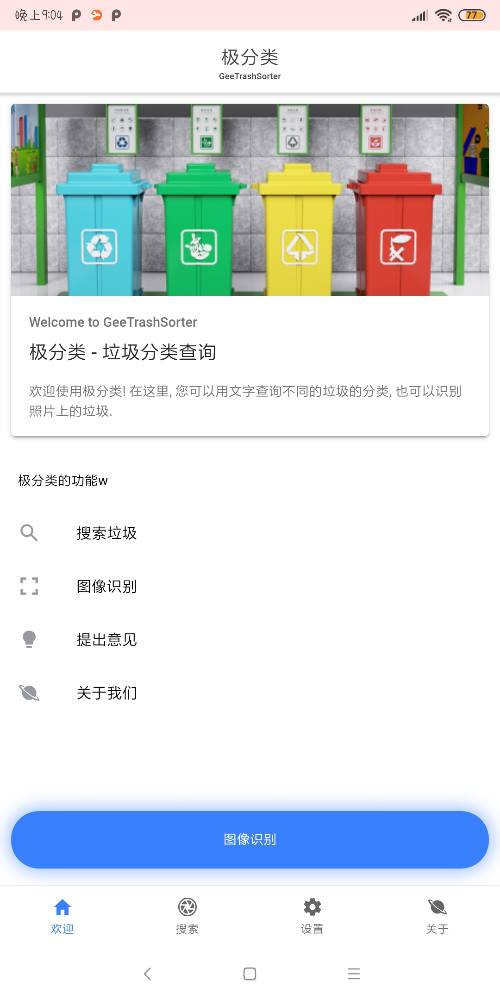
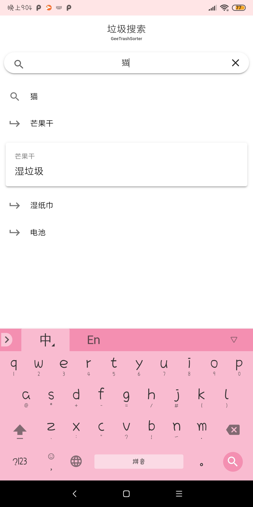
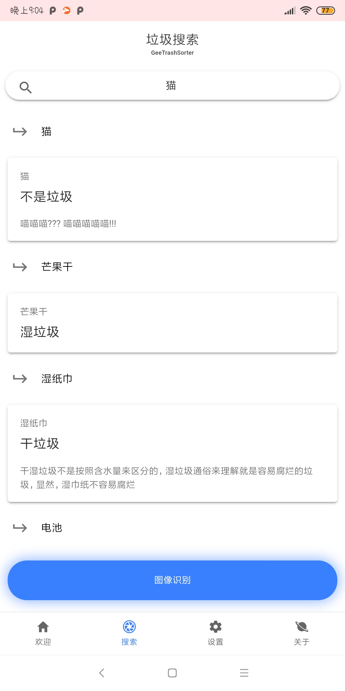

<h1 align="center">
   
   
  极分类
  <h4 align="center">
  一个图像识别的上海/北京垃圾分类应用w
  </h4>
  <h5 align="center">
  <!--
<a href="#maven">Maven 导入</a>&nbsp;&nbsp;
<a href="#environment">环境</a>&nbsp;&nbsp;
<a href="#development">开发</a>&nbsp;&nbsp;
-->
<a href="#screenshots">应用截图</a>&nbsp;&nbsp;
<a href="#license">开源条款</a>
</h5>
   
   
   
</h1>

 

应用截图
-------
  

 

[开源条款](https://choosealicense.com/licenses/mit/): MIT License
--------
